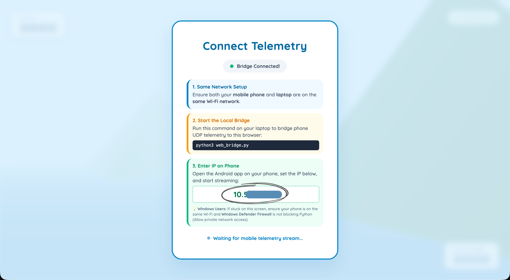
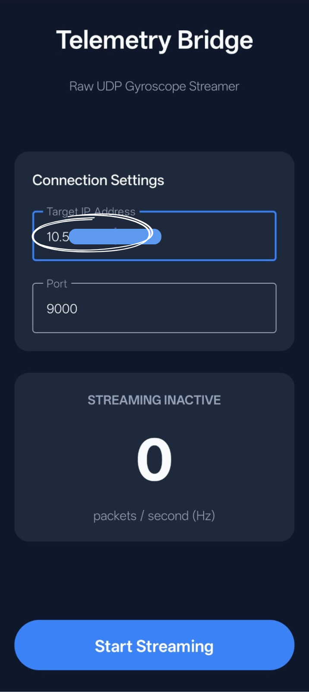

# Paper Plane Ocean Odyssey - Game Consumer

A 3D flight game built with Three.js where you control a paper plane flying over the ocean using your Android phone as a motion controller (via gyroscope telemetry).

## System Architecture

```
[ Android Device (Producer) ] 
       │ (UDP via Wi-Fi: Port 9000)
       ▼
[ Python Bridge (web_bridge.py) ]
       │ (WebSockets: Port 8765)
       ▼
[ Web Browser (index.html) ]
```

---

## Setup & Running the Game

### Prerequisites
- A computer (Mac or Windows) and an Android device connected to the **same Wi-Fi network**.
- **Python 3.x** installed and added to the system PATH.
- The compiled Android application running on your phone.

### Quick Start

#### For macOS:
1. Double-click **`MacOS.command`** in this directory to start the Python server.
   - *Note: On first run, you may need to grant execution permissions by running `chmod +x MacOS.command` in the terminal.*
2. The script will automatically:
   - Create a Python virtual environment (`venv`) if not present.
   - Install required dependencies (`websockets`).
   - Run the Python bridge WebSocket & UDP server.
   - Launch your default web browser to the game page.

#### For Windows:
1. Double-click **`Windows.bat`** in this directory to start the Python server.
2. The script will automatically:
   - Create a Python virtual environment (`venv`) if not present.
   - Install required dependencies (`websockets`).
   - Run the Python bridge WebSocket & UDP server.
   - Launch your default web browser to the game page.

---

## Connecting your Android Controller

1. Find the local IP address displayed on the top-right corner of the web browser game window or in the terminal console (e.g. `192.168.1.X`).
2. Open the **Sensor Bridge** app on your Android device.
3. Enter the IP address shown on the game screen into the IP address input field in the app.
4. Set the port to `9000`.
5. Tap **Connect** / **Start Telemetry** to start streaming. The red status dot in the top-right corner of the game should turn green and show **CONNECTED**.

### Connection Guide Diagrams
Below is the connection flow:

| 1. Get IP from Game UI | 2. Enter IP & Port in Android App |
| :---: | :---: |
|  |  |

*(Place screenshot images named `screenshot_game_ip.png` and `screenshot_android_connect.png` in this directory to display them above.)*

---

## How to Play

### Controls
- **Tilt Controller (Android Device):**
  - **Pitch (Tilt Forward/Backward):** Controls the altitude (climbs up or dives down).
  - **Roll (Tilt Left/Right):** Turns the paper plane left and right.
- **Keyboard Controls (Fallback / Testing):**
  - **Arrow Keys** or **WASD** to steer the plane manually from the keyboard if no phone is connected.

### Objectives & Gameplay
- **Fly through the golden ring hoops** to score points (+10 pts per ring).
- Passing through a ring increases your flight speed.
- **Avoid crashing** into the ocean surface or missing a ring hoop.
- If you miss a ring hoop or touch the water, the game ends.
- Adjust the controller sensitivity (Pitch/Roll) on the bottom-left settings panel of the screen to tune control response.
